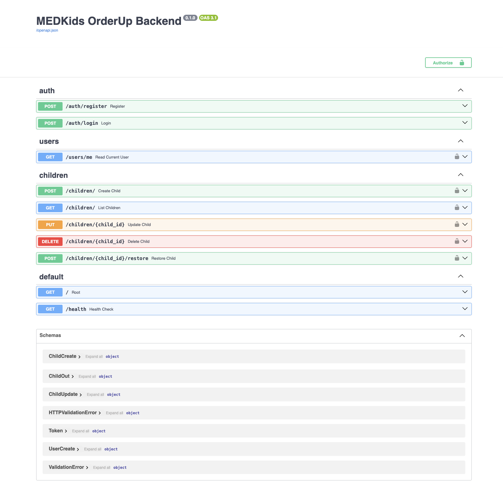
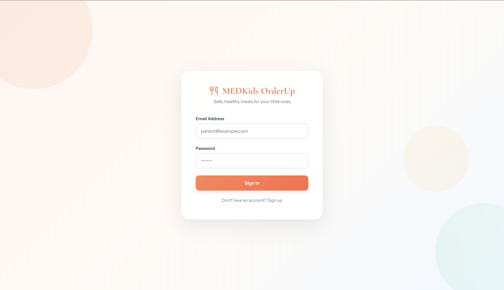
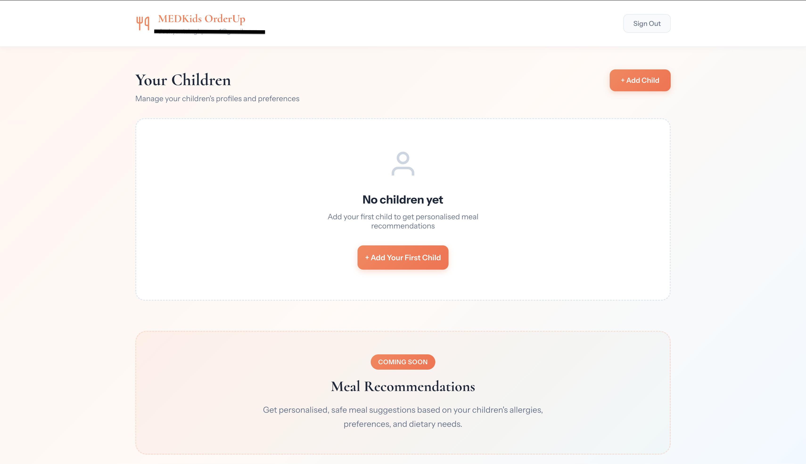
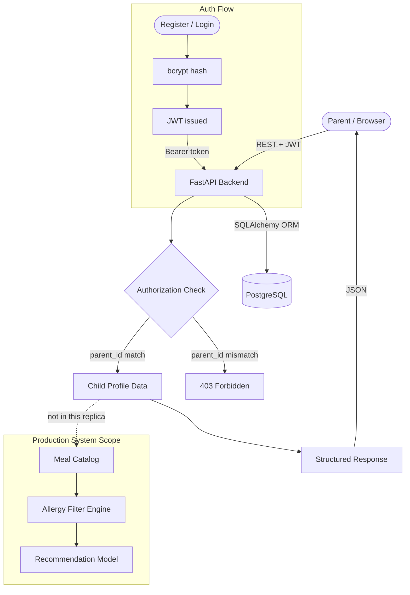
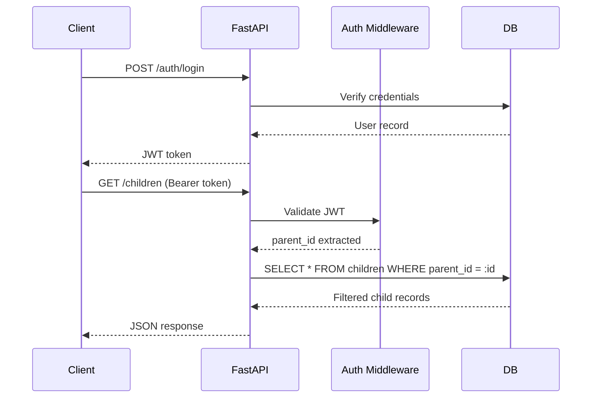

# MedKids OrderUp

**A backend-first platform for structured child nutrition preference management and safe meal filtering - built correctness-first, intelligence later.**

> This system does not cook, deliver, or currently recommend meals.
> It builds the infrastructure required to do so safely.

---

## About This Repository

This is an MVP replica of the MedKids OrderUp backend I built and led at Rebecca Everlene Trust Company, rebuilt independently to demo the system's architecture to clients and stakeholders. The production codebase is employer-owned and private.

The production system this replica is based on spans 21 REST endpoints, holds 92% line / 84% branch test coverage on the server, runs a Python AI service at 100% pytest coverage, rotates JWTs on 15-minute access / 7-day refresh intervals, and normalizes allergy input through an engine covering 11 canonical allergens with a ~180-entry synonym map.

This replica reproduces the foundation those features stand on: multi-tenant data isolation enforced at the query level, JWT authentication, migration-safe schema evolution, and stable API contracts. It is intentionally scoped down and rebuilt on a different stack - FastAPI and PostgreSQL here, versus the production system's Node/Express API and FastAPI AI microservice over MongoDB Atlas. The sections below describe exactly what is and isn't here.

---

## Screenshots

**Swagger UI - Live API Explorer**


**Login Screen**


**Child Profile Dashboard**


---

## The Problem

Parents choosing meals for children must simultaneously balance allergies, dietary restrictions, cultural preferences, and age-appropriate nutrition. Most recommendation systems optimize for engagement, not safety.

Before any AI model can operate, these guarantees must hold:

- No cross-family data exposure - ever
- Dietary constraints stored with full fidelity
- Every decision traceable to its inputs
- API contracts stable enough to build on

MedKids OrderUp implements the safety layer first. The intelligence comes later, and only once the foundation is solid.

---

## System Architecture



---

## Request Lifecycle



---

## Current Capabilities

### Authentication

- User registration and login
- JWT bearer tokens
- Password hashing with bcrypt

### Child Profile Management

- Create, read, update, and delete child profiles
- Storage of allergies, dietary constraints, and dislikes
- Parent ownership enforced at the query level
- Soft delete to prevent accidental data loss

### API Guarantees

- All child endpoints scoped to the authenticated parent - no exceptions
- Pydantic validation on all inputs
- Consistent HTTP error responses

### Frontend

- Login and child management UI
- Communicates directly with backend APIs
- Stateless - all logic lives in the backend

---

## Data Model

```
User (Parent)
├── id
├── email
├── hashed_password
├── is_active
├── created_at
└── updated_at

Child
├── id
├── name
├── age
├── allergies
├── diet_preferences
├── dislikes
├── parent_id           ← enforced on every query
├── deleted_at          ← soft delete
├── created_at
└── updated_at
```

One parent owns many children. Cross-parent access is impossible by design - not by convention.

---

## Security Model

**Authentication** - Bearer JWTs, secret stored in environment variables only.

**Authorization** - Every child query is filtered by `parent_id` extracted from the token. There is no mechanism to retrieve another parent's data.

**Data Protection** - All passwords hashed with bcrypt. Inputs validated before they touch the database. Soft delete ensures records are recoverable before permanent removal.

**In the production system** - Rotating JWTs (15-minute access / 7-day refresh), bcrypt at 12 salt rounds, and allergen input normalization before storage.

---

## Technology Stack

| Layer          | Technology                   |
| -------------- | ---------------------------- |
| Language       | Python 3.12                  |
| API Framework  | FastAPI                      |
| Database       | PostgreSQL                   |
| ORM            | SQLAlchemy                   |
| Migrations     | Alembic                      |
| Auth           | JWT via python-jose + bcrypt |
| Frontend       | Vanilla JavaScript, HTML/CSS |
| Infrastructure | Docker Compose               |
| API Docs       | OpenAPI / Swagger            |

---

## API Reference

```
Authentication
  POST   /auth/register
  POST   /auth/login

User
  GET    /users/me

Children  (all require Authorization: Bearer <token>)
  POST   /children
  GET    /children
  PUT    /children/{id}
  DELETE /children/{id}
```

The production system extends this surface to 21 endpoints across meal catalog, allergy filtering, and ordering workflows.

---

## Local Setup

```bash
# Clone
git clone https://github.com/dushyantsinghpawar/medkids-orderup-backend.git
cd medkids-orderup-backend

# Environment
python3 -m venv .venv
source .venv/bin/activate
pip install -r requirements.txt

# Configuration
cp .env.example .env

# Database
docker-compose up -d
alembic upgrade head

# Server
uvicorn app.main:app --reload
```

Running at `http://localhost:8000`
Swagger UI at `http://localhost:8000/docs`

---

## Testing

Key behaviors to verify before considering any endpoint stable:

- Unauthenticated requests are rejected with `401`
- A parent cannot retrieve, modify, or delete another parent's children
- Soft-deleted children are excluded from all list responses
- Expired or malformed tokens are rejected outright

The production system holds 92% line / 84% branch server coverage; this replica carries a scoped-down suite covering the auth and ownership boundaries above.

---

## Design Philosophy

The project intentionally defers machine learning.

**Correctness before intelligence.**
**Safety before automation.**
**Contracts before features.**

A recommendation engine is only as trustworthy as the data it consumes. MedKids OrderUp ensures that data is worth trusting before asking a model to reason over it.

---

## Not In This Replica

- Meal catalog and ordering workflows
- Allergen normalization engine
- Recommendation engine
- Python AI service
- Admin management panel
- Production deployment configuration

---

## License

MIT License
