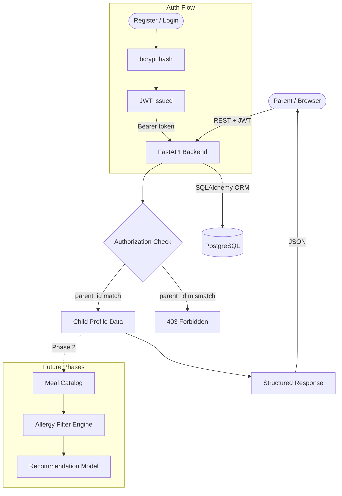
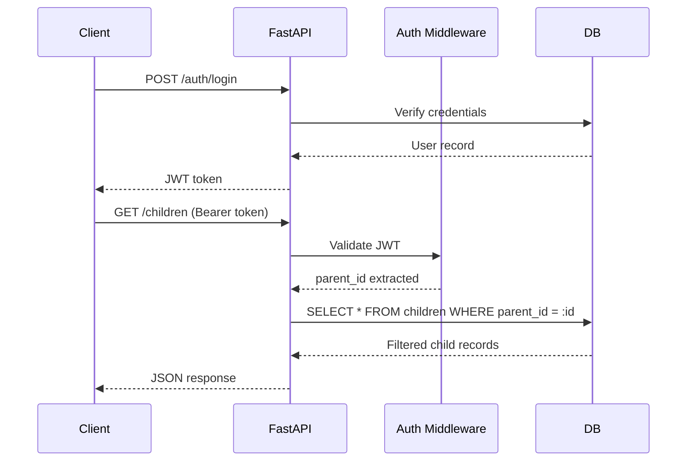
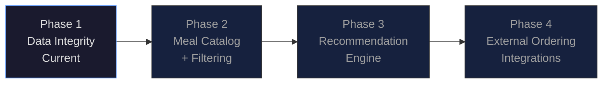

# MEDKids OrderUp

**A backend-first platform for structured child nutrition preference management and safe meal filtering — built correctness-first, intelligence later.**

> This system does not cook, deliver, or currently recommend meals.  
> It builds the infrastructure required to do so safely.

---

## Screenshots

**Swagger UI — Live API Explorer**  


**Login Screen**  


**Child Profile Dashboard**  


---

## The Problem

Parents choosing meals for children must simultaneously balance allergies, dietary restrictions, cultural preferences, and age-appropriate nutrition. Most recommendation systems optimize for engagement, not safety.

Before any AI model can operate, three guarantees must hold:

- No cross-family data exposure — ever
- Dietary constraints stored with full fidelity
- Every decision traceable to its inputs
- API contracts stable enough to build on

MEDKids OrderUp implements the safety layer first. The intelligence comes later, and only once the foundation is solid.

---

## System Architecture



---

## Request Lifecycle



---

## Development Roadmap



---

## Current Capabilities

### Authentication
- User registration and login
- JWT bearer tokens
- Password hashing with bcrypt

### Child Profile Management
- Create, read, update, and delete child profiles
- Storage of allergies, dietary constraints, and dislikes
- Parent ownership enforced at the query level
- Soft delete to prevent accidental data loss

### API Guarantees
- All child endpoints scoped to the authenticated parent — no exceptions
- Pydantic validation on all inputs
- Consistent HTTP error responses

### Frontend
- Login and child management UI
- Communicates directly with backend APIs
- Stateless — all logic lives in the backend

---

## Data Model

```
User (Parent)
├── id
├── email
├── hashed_password
├── is_active
├── created_at
└── updated_at

Child
├── id
├── name
├── age
├── allergies
├── diet_preferences
├── dislikes
├── parent_id           ← enforced on every query
├── deleted_at          ← soft delete
├── created_at
└── updated_at
```

One parent owns many children. Cross-parent access is impossible by design — not by convention.

---

## Security Model

**Authentication** — Bearer JWTs, secret stored in environment variables only.

**Authorization** — Every child query is filtered by `parent_id` extracted from the token. There is no mechanism to retrieve another parent's data.

**Data Protection** — All passwords hashed with bcrypt. Inputs validated before they touch the database. Soft delete ensures records are recoverable before permanent removal.

**Planned Hardening** — Refresh tokens, rate limiting, audit logs, role separation.

---

## Technology Stack

| Layer | Technology |
|---|---|
| Language | Python 3.12 |
| API Framework | FastAPI |
| Database | PostgreSQL |
| ORM | SQLAlchemy |
| Migrations | Alembic |
| Auth | JWT via python-jose + bcrypt |
| Frontend | Vanilla JavaScript, HTML/CSS |
| Infrastructure | Docker Compose |
| API Docs | OpenAPI / Swagger |

---

## API Reference

```
Authentication
  POST   /auth/register
  POST   /auth/login

User
  GET    /users/me

Children  (all require Authorization: Bearer <token>)
  POST   /children
  GET    /children
  PUT    /children/{id}
  DELETE /children/{id}
```

---

## Local Setup

```bash
# Clone
git clone https://github.com/dushyantsinghpawar/medkids-orderup-backend.git
cd medkids-orderup-backend

# Environment
python3 -m venv .venv
source .venv/bin/activate
pip install -r requirements.txt

# Configuration
cp .env.example .env

# Database
docker-compose up -d
alembic upgrade head

# Server
uvicorn app.main:app --reload
```

Running at `http://localhost:8000`  
Swagger UI at `http://localhost:8000/docs`

---

## Testing

Manual validation is currently supported through Swagger UI.

Key behaviors to verify before considering any endpoint stable:

- Unauthenticated requests are rejected with `401`
- A parent cannot retrieve, modify, or delete another parent's children
- Soft-deleted children are excluded from all list responses
- Expired or malformed tokens are rejected outright

Automated test coverage via `pytest` and `FastAPI TestClient` is planned for Phase 2.

---

## Design Philosophy

The project intentionally defers machine learning.

**Correctness before intelligence.**  
**Safety before automation.**  
**Contracts before features.**

A recommendation engine is only as trustworthy as the data it consumes. MEDKids OrderUp ensures that data is worth trusting before asking a model to reason over it.

---

## Not Implemented Yet

- Meal catalog
- Recommendation engine
- External delivery integrations
- Admin management panel
- Production deployment configuration

---

## License

MIT License
